<div align="center">

# 🏥 MediCare

### *Your Health Appointments, Made Easy*

**A full-stack Android healthcare app connecting Patients, Doctors, and Admins — powered by Firebase.**

<br/>

[](https://kotlinlang.org)
[](https://developer.android.com)
[](https://firebase.google.com)
[](https://material.io)
[](https://developers.google.com/maps)
[](LICENSE)

<br/>

[Features](#-features) • [Tech Stack](#-tech-stack) • [Architecture](#-project-structure) • [Setup](#-getting-started) • [Screenshots](#-screenshots) • [Modules](#-modules) • [Roadmap](#-roadmap)

</div>

---

## 📖 Overview

**MediCare** is a production-grade Android application that digitizes the entire healthcare appointment workflow. It eliminates physical queues and phone-based booking by providing a seamless mobile experience for **three distinct user roles**:

| Role | Access | Capabilities |
|------|--------|-------------|
| 🧑‍💼 **Patient** | Patient Panel | Browse doctors, select time slots, book & manage appointments, explore hospitals on map |
| 👨‍⚕️ **Doctor** | Doctor Panel | Manage schedules, accept/reject appointments, track patient stats |
| 🛡️ **Admin** | Admin Panel | Oversee doctors, users, platform-wide statistics |

All data syncs in **real time** via Firebase Realtime Database with zero server management.

---

## ✨ Features

### 🧑‍💼 Patient Module
- **3-Screen Onboarding** — guided first-launch experience with Skip support
- **Role-based Registration** — card-based Patient / Doctor role selector during signup
- **Home Dashboard** — auto-sliding promotional banner (ViewPager2), specialty category grid (Dentistry, Cardiology, Pulmonology, Neurology, Gastroenterology, Laboratory, Vaccination), real-time Top Doctors list
- **Doctor Discovery** — full searchable doctor list with real-time filter by name, specialty, or clinic
- **Doctor Details** — complete profile view with stats, about, working hours, consultation fee
- **Smart Time Slot Booking** — CalendarView date picker + Morning/Afternoon slot grids generated from doctor schedules; booked slots auto-excluded
- **Double-Booking Prevention** — server-side validation before appointment confirmation
- **My Bookings** — tabbed view (Upcoming / Completed / Cancelled) with one-tap cancellation
- **Hospital Locator** — Google Maps integration with custom markers and scrollable nearby hospital list
- **Profile Management** — edit personal info, upload profile photo to Firebase Storage

### 👨‍⚕️ Doctor Module
- **Dashboard** — personalized greeting, 4-stat grid (Total Patients, Appointments, Today's, Rating), today's appointment list
- **Schedule Management** — add/edit/delete weekly schedules with day chips, TimePicker dialogs, and configurable slot duration
- **Appointment Management** — Accept / Reject incoming patient requests in real time
- **Profile Editing** — update all professional fields (specialty, clinic, fees, bio, hours) + photo upload

### 🛡️ Admin Module
- **Dashboard** — real-time platform stats (Total Bookings, Doctors, Users, Avg Rating) + Top Doctors list
- **Doctor Management** — searchable doctor list cross-referenced with schedule summaries; status badges (Active / On Leave)
- **User Management** — searchable patient list with booking count and join date

### 🔐 Auth & Session
- Firebase Email/Password Authentication
- `SessionManager` (SharedPreferences) for persistent login state across app restarts
- `LogoutHelper` with AlertDialog confirmation, `FirebaseAuth.signOut()` + session clear
- Splash screen with session-based auto-routing (2.5s logo animation → correct dashboard)

---

## 🛠 Tech Stack

| Category | Technology | Version |
|----------|-----------|---------|
| **Language** | Kotlin | 2.0.21 |
| **Min SDK** | Android (Nougat) | API 24 |
| **Target SDK** | Android 14 | API 35 |
| **UI** | XML Layouts + ViewBinding | — |
| **Design System** | Material Design Components | 1.12.0 |
| **Auth** | Firebase Authentication | BOM 33.7.0 |
| **Database** | Firebase Realtime Database | BOM 33.7.0 |
| **Storage** | Firebase Storage | BOM 33.7.0 |
| **Maps** | Google Maps Android SDK | 19.0.0 |
| **Image Loading** | Glide | 4.16.0 |
| **Build System** | Gradle Kotlin DSL | AGP 8.7.3 |
| **Architecture** | Activity / Fragment + ViewBinding | — |

---

## 📁 Project Structure

```
MediCare/
├── app/
│   ├── src/main/
│   │   ├── java/com/example/medicare/
│   │   │   │
│   │   │   ├── auth/                          # Authentication flow
│   │   │   │   ├── SplashActivity.kt          # Session check + logo animation
│   │   │   │   ├── OnboardingScreen01/02/03.kt # 3-step onboarding
│   │   │   │   ├── SignupActivity.kt           # Registration with role selector
│   │   │   │   └── LoginActivity.kt           # Firebase email/password login
│   │   │   │
│   │   │   ├── Patient/                       # Patient module
│   │   │   │   ├── activities/
│   │   │   │   │   ├── MainActivity.kt        # Bottom nav host (Home/Bookings/Map/Profile)
│   │   │   │   │   ├── AllDoctorsActivity.kt  # Searchable doctor list
│   │   │   │   │   ├── DoctorDetailsActivity.kt
│   │   │   │   │   ├── SelectTimeSlotActivity.kt  # Calendar + slot grid
│   │   │   │   │   ├── BookingConfirmationActivity.kt
│   │   │   │   │   └── EditProfileActivity.kt
│   │   │   │   ├── fragments/
│   │   │   │   │   ├── PatientHomeFragment.kt # Banner + categories + top doctors
│   │   │   │   │   ├── MyBookingsFragment.kt  # Tabbed appointment history
│   │   │   │   │   ├── PatientMapFragment.kt  # Google Maps hospital locator
│   │   │   │   │   └── PatientProfileFragment.kt
│   │   │   │   ├── adapters/                  # BannerAdapter, BookingAdapter, TimeSlotAdapter, ...
│   │   │   │   ├── models/                    # AppointmentModel, DoctorModel, UserProfile, ...
│   │   │   │   └── model/                     # BookingModel, TimeSlotModel, DoctorDetailsModel
│   │   │   │
│   │   │   ├── Doctor/                        # Doctor module
│   │   │   │   ├── activities/
│   │   │   │   │   ├── DoctorMainActivity.kt  # Bottom nav host
│   │   │   │   │   ├── AddDoctorActivity.kt   # First-time doctor profile setup
│   │   │   │   │   └── DoctorEditProfileActivity.kt
│   │   │   │   ├── fragment/
│   │   │   │   │   ├── DoctorDashboardFragment.kt
│   │   │   │   │   ├── DoctorAppointmentsFragment.kt
│   │   │   │   │   ├── DoctorScheduleFragment.kt  # Day chips + TimePicker CRUD
│   │   │   │   │   └── DoctorProfileFragment.kt
│   │   │   │   ├── adapter/                   # DoctorAdapter, ScheduleAdapter, DoctorAppointmentsAdapter, ...
│   │   │   │   ├── model/                     # DoctorModel, AppointmentModel, ScheduleModel, ...
│   │   │   │   └── utils/
│   │   │   │       └── FirebaseDoctorHelper.kt  # Save/get doctor profile from Firebase
│   │   │   │
│   │   │   ├── Admin/                         # Admin module
│   │   │   │   ├── activities/
│   │   │   │   │   └── AdminMainActivity.kt   # Bottom nav host
│   │   │   │   ├── fragment/
│   │   │   │   │   ├── AdminDashboardFragment.kt  # Stats + Top Doctors
│   │   │   │   │   ├── AdminDoctorsFragment.kt    # Search + schedule summary
│   │   │   │   │   ├── AdminUsersFragment.kt      # Patient list + booking count
│   │   │   │   │   └── AdminProfileFragment.kt
│   │   │   │   ├── adapter/                   # AdminDoctorsAdapter, UsersAdapter, TopDoctorsAdapter, ...
│   │   │   │   └── model/                     # AdminDoctorModel, UserModel, DashboardStatsModel, ...
│   │   │   │
│   │   │   └── utils/
│   │   │       ├── SessionManager.kt          # SharedPreferences login session
│   │   │       └── LogoutHelper.kt            # Firebase signOut + session clear
│   │   │
│   │   ├── res/
│   │   │   ├── layout/        # XML layouts for all activities and fragments
│   │   │   ├── drawable/      # Vector icons, backgrounds, shapes, gradients
│   │   │   ├── anim/          # Slide, fade, zoom animations
│   │   │   ├── color/         # State-based color selectors (nav, gender button, etc.)
│   │   │   ├── menu/          # Bottom navigation menus (patient, doctor, admin)
│   │   │   └── values/        # colors.xml, strings.xml, styles.xml, themes.xml
│   │   │
│   │   └── AndroidManifest.xml
│   │
│   ├── build.gradle.kts
│   └── google-services.json   # Firebase configuration (replace with your own)
│
├── gradle/
│   └── libs.versions.toml     # Version catalog
└── settings.gradle.kts
```

---

## 🔥 Firebase Realtime Database Structure

```
medicare-81026 (Firebase Project)
│
├── users/
│   └── {uid}/
│       ├── fullName       : String
│       ├── email          : String
│       ├── role           : "Patient" | "Doctor" | "Admin"
│       ├── joinedDate     : String
│       ├── imageUrl       : String
│       └── createdAt      : Long
│
├── Doctors/
│   └── {uid}/
│       ├── doctorUid, doctorId, fullName, doctorName
│       ├── designation, specialty, experience
│       ├── phone, email, clinicName, clinicAddress
│       ├── consultationFee, about, imageUrl
│       ├── rating, role, startTime, endTime
│       └── createdAt      : Long
│
├── Appointments/
│   └── {BOOK_{timestamp}}/
│       ├── bookingId      : "BOOK_{timestamp}"
│       ├── patientUid, doctorUid
│       ├── doctorName, patientName, doctorImage, doctorSpecialty
│       ├── appointmentDate, appointmentDay, appointmentTime
│       ├── status         : "Upcoming" | "Completed" | "Cancelled" | "Accepted" | "Rejected"
│       └── createdAt      : Long
│
├── DoctorSchedules/
│   └── {doctorUid}/
│       └── {scheduleId}/
│           ├── id, day, startTime, endTime
│           └── slotDuration : String (minutes)
│
└── banners/
    └── {id}/
        ├── imageUrl, title, subtitle
```

---

## 🚀 Getting Started

### Prerequisites

- Android Studio (Flamingo or later)
- JDK 11+
- Android device / emulator running API 24+
- A Firebase project (free tier works)
- Google Maps API Key

### 1. Clone the Repository

```bash
git clone https://github.com/your-username/MediCare.git
cd MediCare
```

### 2. Firebase Setup

1. Go to [Firebase Console](https://console.firebase.google.com/) → **Create a project**
2. Add an Android app with package name `com.example.medicare`
3. Download `google-services.json` and place it in `app/`
4. Enable the following Firebase services:
   - **Authentication** → Email/Password provider
   - **Realtime Database** → Start in test mode, then apply security rules
   - **Storage** → Default bucket

5. Set Firebase Realtime Database rules:
```json
{
  "rules": {
    "users": {
      "$uid": {
        ".read": "$uid === auth.uid",
        ".write": "$uid === auth.uid"
      }
    },
    "Doctors": {
      ".read": "auth != null",
      "$uid": {
        ".write": "$uid === auth.uid"
      }
    },
    "Appointments": {
      ".read": "auth != null",
      ".write": "auth != null"
    },
    "DoctorSchedules": {
      ".read": "auth != null",
      "$uid": {
        ".write": "$uid === auth.uid"
      }
    },
    "banners": {
      ".read": "auth != null"
    }
  }
}
```

### 3. Google Maps Setup

1. Go to [Google Cloud Console](https://console.cloud.google.com/) → Enable **Maps SDK for Android**
2. Create an API key
3. Replace the placeholder in `AndroidManifest.xml`:

```xml
<meta-data
    android:name="com.google.android.geo.API_KEY"
    android:value="YOUR_GOOGLE_MAPS_API_KEY_HERE" />
```

### 4. Create Admin Account

Since Admin registration is not exposed in-app, create it manually:

1. In Firebase Console → **Authentication** → Add a user (email/password)
2. Copy the generated UID
3. In **Realtime Database**, create the node:
```json
{
  "users": {
    "{admin-uid}": {
      "fullName": "Admin",
      "email": "admin@medicare.com",
      "role": "Admin",
      "joinedDate": "Jan 01, 2026",
      "createdAt": 1735689600000
    }
  }
}
```

### 5. Build & Run

```bash
# Open in Android Studio → Sync Gradle → Run on device/emulator
```

Or via terminal:
```bash
./gradlew assembleDebug
adb install app/build/outputs/apk/debug/app-debug.apk
```

---

## 📱 Screenshots

> *Add your screenshots to a `/screenshots` folder and update the paths below.*

### Auth Flow

| Splash | Onboarding 1 | Onboarding 2 | Sign Up | Log In |
|:------:|:------------:|:------------:|:-------:|:------:|
| 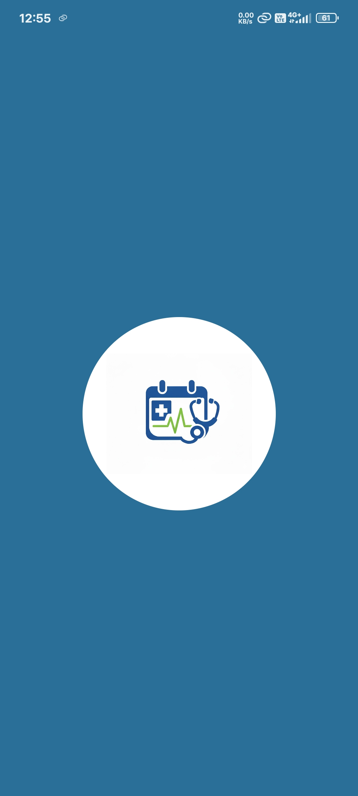 | 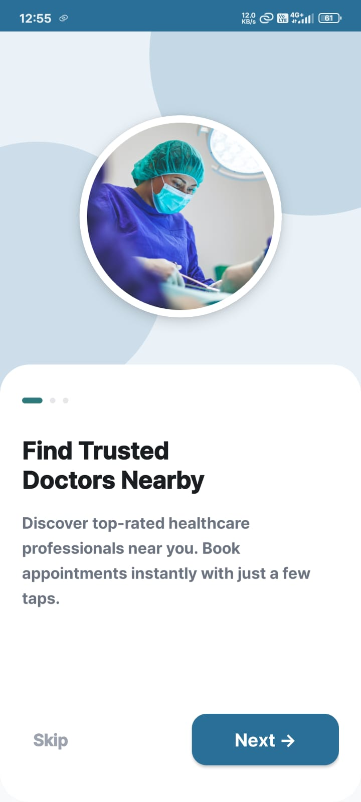 | 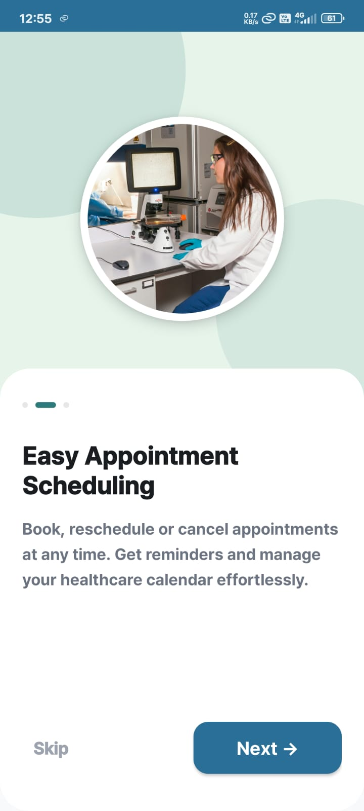 | 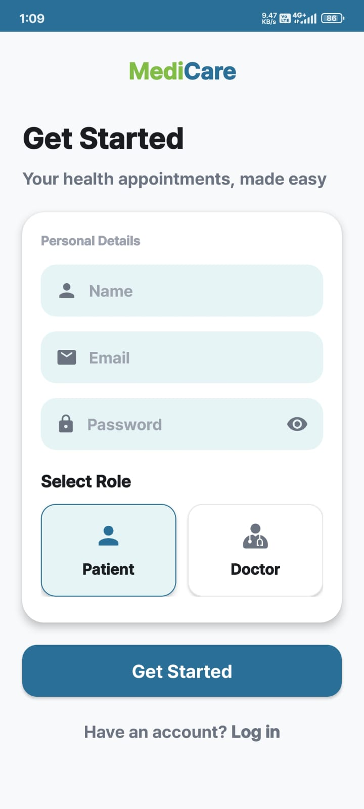 | 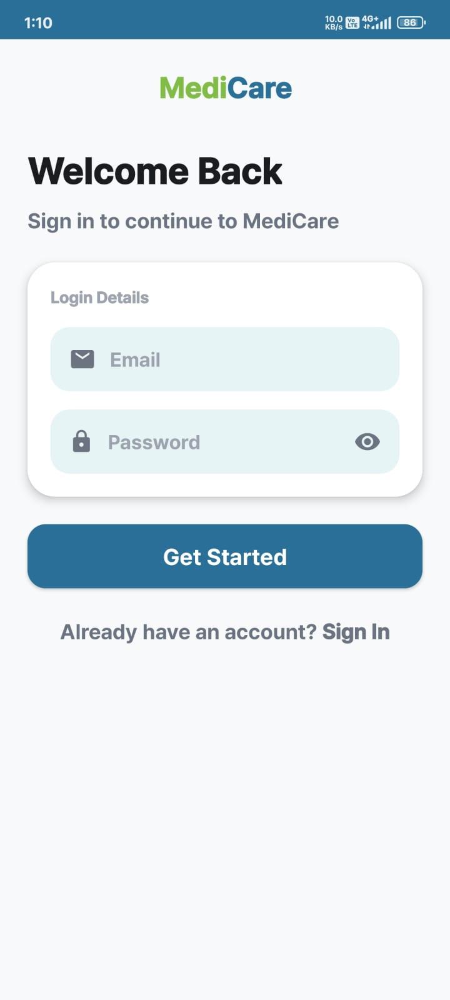 |

### Patient Module

| Home | Doctor List | Doctor Details | Time Slot | Confirmation |
|:----:|:-----------:|:--------------:|:---------:|:------------:|
| 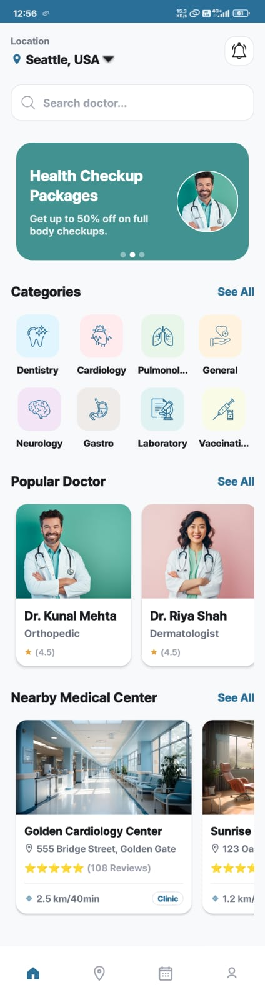 | 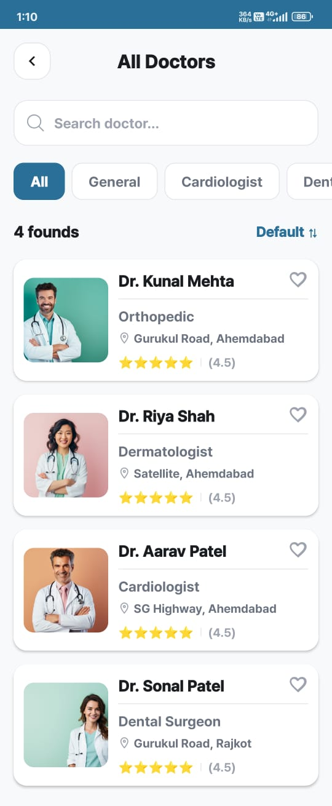 | 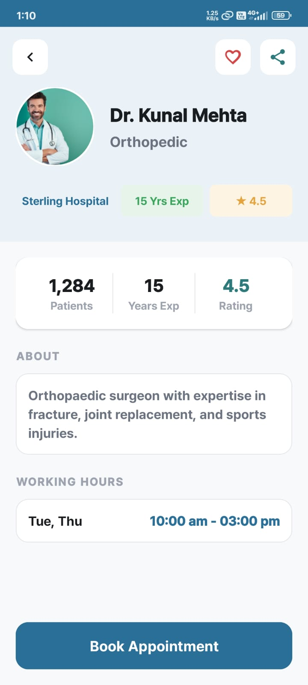 | 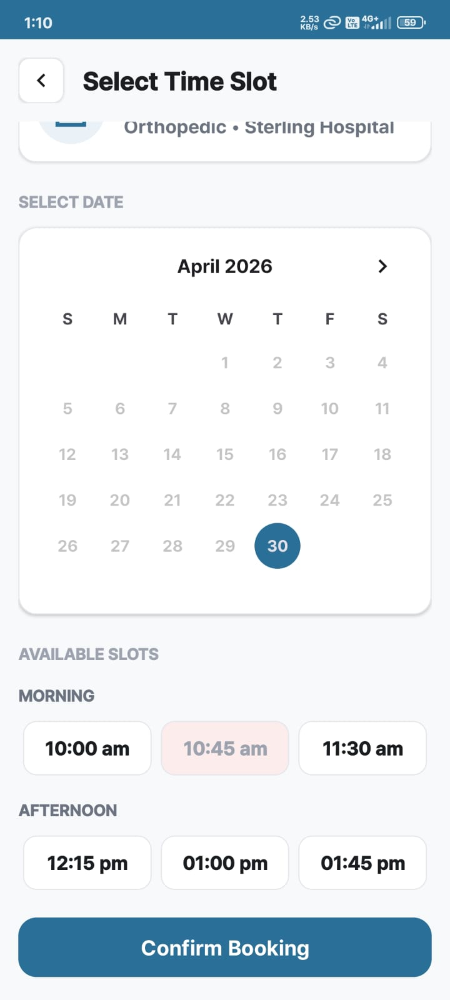 | 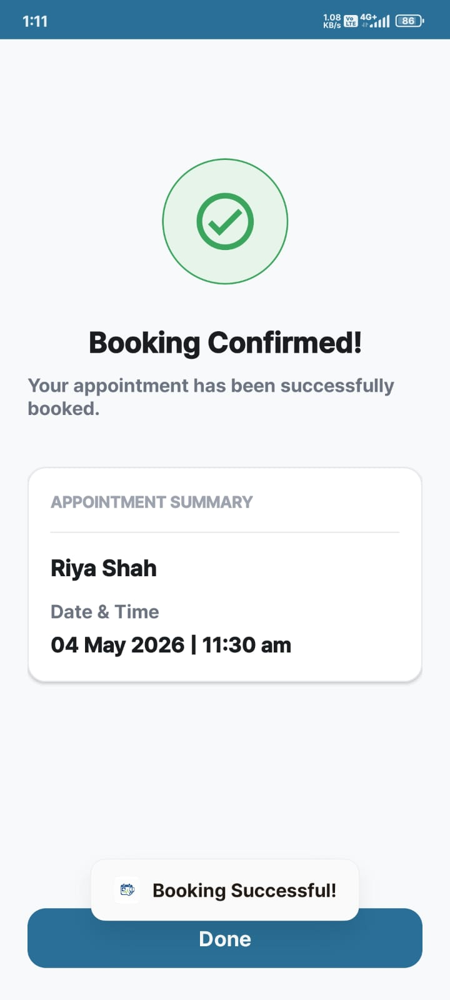 |

| My Bookings | Patient Profile | Edit Profile |
|:-----------:|:---------------:|:------------:|
| 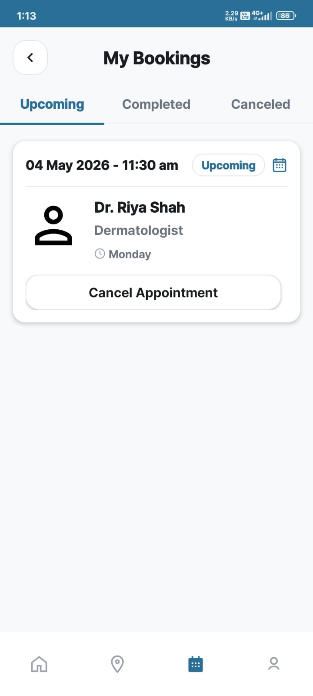 | 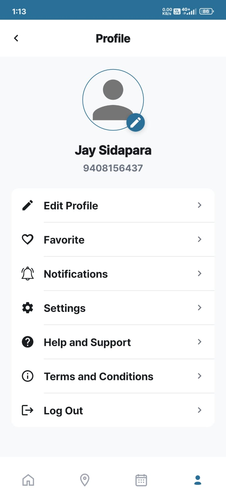 | 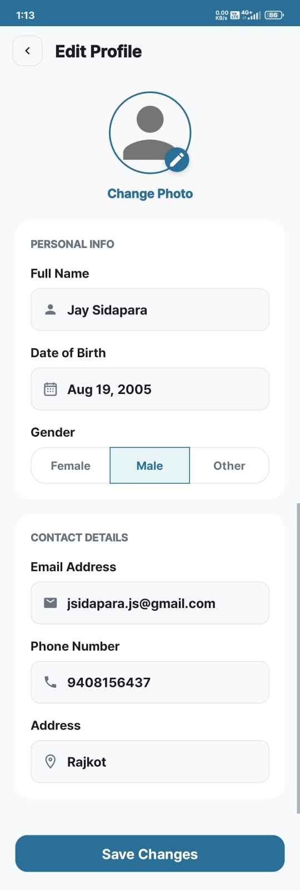 |

### Doctor Module

| Dashboard | Appointments | Schedule | Doctor Profile |
|:---------:|:------------:|:--------:|:--------------:|
| 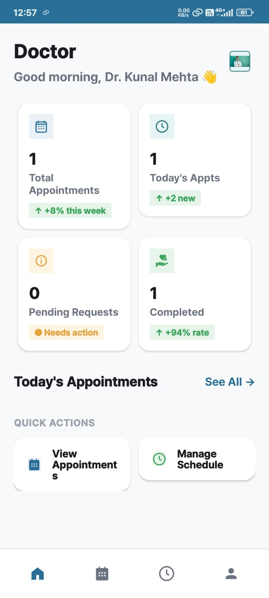 | 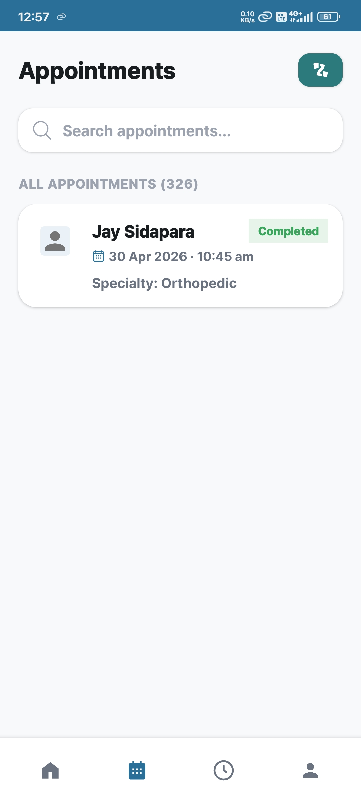 | 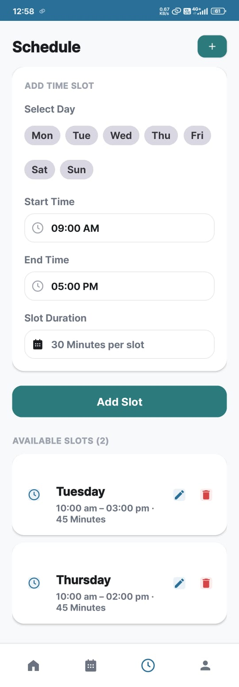 | 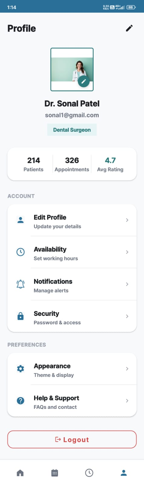 |

### Admin Module

| Admin Dashboard | Doctor Management | User Management | Admin Profile |
|:---------------:|:-----------------:|:---------------:|:-------------:|
| 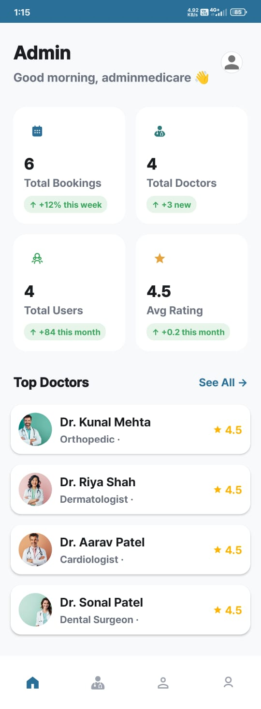 | 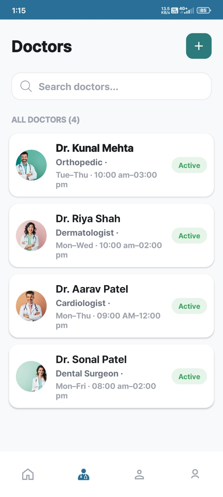 | 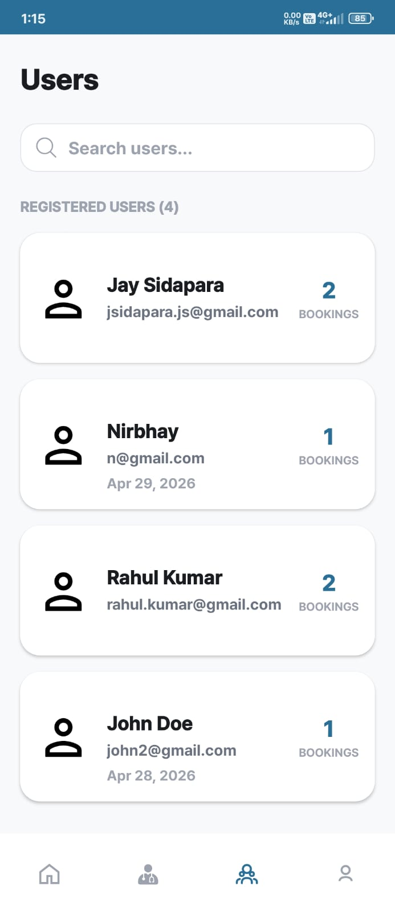 | 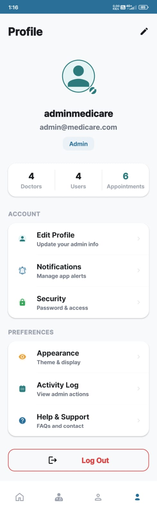 |

---

## 📦 Modules

### `auth` — Authentication & Onboarding
| File | Responsibility |
|------|---------------|
| `SplashActivity` | 2.5s logo animation → session check → auto-route to correct dashboard |
| `OnboardingScreen01/02/03Activity` | 3-step illustrated onboarding with Next/Skip navigation |
| `SignupActivity` | Firebase account creation with card-based Patient/Doctor role selector |
| `LoginActivity` | Firebase email/password auth → role fetch → SessionManager save |

### `Patient` — Patient Experience
| Component | Responsibility |
|-----------|---------------|
| `PatientHomeFragment` | Auto-sliding banner (ViewPager2), specialty categories, top doctors, hospital cards |
| `AllDoctorsActivity` | Real-time searchable doctor list (name / specialty / clinic) |
| `DoctorDetailsActivity` | Full profile: stats, bio, hours, fee, Book Appointment CTA |
| `SelectTimeSlotActivity` | CalendarView + Morning/Afternoon slot grids from `DoctorSchedules` node |
| `BookingConfirmationActivity` | Double-booking validation → save `AppointmentModel` to Firebase |
| `MyBookingsFragment` | Tabbed (Upcoming / Completed / Cancelled) with cancellation AlertDialog |
| `PatientMapFragment` | Google Maps with custom hospital markers + horizontal hospital RecyclerView |
| `EditProfileActivity` | Update name, DOB, gender, phone, address; Firebase Storage photo upload |

### `Doctor` — Doctor Panel
| Component | Responsibility |
|-----------|---------------|
| `DoctorDashboardFragment` | Stats grid (patients/appointments/today/rating) + today's appointment list |
| `DoctorScheduleFragment` | CRUD for weekly schedules using day chips, TimePickerDialogs, slot duration |
| `DoctorAppointmentsFragment` | Accept / Reject patient requests → Firebase status update |
| `DoctorEditProfileActivity` | Full professional profile editor with Firebase Storage photo upload |
| `FirebaseDoctorHelper` | Reusable utility for reading/writing doctor profiles to `Doctors` node |

### `Admin` — Administration Panel
| Component | Responsibility |
|-----------|---------------|
| `AdminDashboardFragment` | Platform stats (total bookings, doctors, users, avg rating) + Top Doctors list |
| `AdminDoctorsFragment` | Searchable doctor list; schedule summary cross-referenced from `DoctorSchedules` |
| `AdminUsersFragment` | Searchable patient list with booking count aggregated from `Appointments` node |

### `utils` — Shared Utilities
| File | Responsibility |
|------|---------------|
| `SessionManager` | SharedPreferences wrapper for `isLoggedIn`, `userRole`, `userEmail` |
| `LogoutHelper` | AlertDialog → `FirebaseAuth.signOut()` → session clear → LoginActivity |

---

## 🗺 Navigation Flow

```
SplashActivity
    │
    ├── [Session Exists] ──────────────────────────────────────┐
    │                                                           │
    └── [No Session] → Onboarding 1 → 2 → 3 → SignupActivity  │
                                           └──────────────────→ LoginActivity
                                                                │
                        ┌───────────────────────────────────────┤
                        │              role check               │
                        ▼                     ▼                 ▼
               MainActivity          DoctorMainActivity   AdminMainActivity
           (Patient Bottom Nav)    (Doctor Bottom Nav)   (Admin Bottom Nav)
           ┌──────────────────┐   ┌────────────────────┐  ┌──────────────────┐
           │ Home             │   │ Dashboard          │  │ Dashboard        │
           │ My Bookings      │   │ Appointments       │  │ Doctors          │
           │ Map              │   │ Schedule           │  │ Users            │
           │ Profile          │   │ Profile            │  │ Profile          │
           └──────────────────┘   └────────────────────┘  └──────────────────┘
```

---

## 🚧 Roadmap

| Feature | Status | Target |
|---------|--------|--------|
| 🔔 FCM Push Notifications (appointment alerts, reminders) | Planned | v1.1 |
| ⭐ Doctor Ratings & Reviews after completed appointments | Planned | v1.2 |
| 💳 Online Payment Gateway (Razorpay / Stripe) | Planned | v1.2 |
| 🗺 Live Hospital Discovery via Google Places API | Planned | v1.2 |
| 💬 In-App Patient–Doctor Chat (Firebase Realtime) | Planned | v1.3 |
| 📊 Admin Analytics Dashboard with charts | Planned | v1.3 |
| 📄 Digital Prescription Upload / Download | Planned | v1.4 |
| 🌐 Multi-language Support (Hindi / Gujarati) | Planned | v2.0 |
| 📹 Video Consultation (WebRTC / Agora) | Planned | v2.0 |

---

## 🤝 Contributing

Contributions are welcome! Here's how to get started:

1. **Fork** the repository
2. Create a feature branch: `git checkout -b feature/your-feature-name`
3. Commit your changes: `git commit -m 'feat: add your feature'`
4. Push to your branch: `git push origin feature/your-feature-name`
5. Open a **Pull Request**

Please follow [Kotlin coding conventions](https://kotlinlang.org/docs/coding-conventions.html) and ensure your code compiles without warnings.

---

## 📄 License

```
MIT License

Copyright (c) 2026 Jay Sidapara

Permission is hereby granted, free of charge, to any person obtaining a copy
of this software and associated documentation files (the "Software"), to deal
in the Software without restriction, including without limitation the rights
to use, copy, modify, merge, publish, distribute, sublicense, and/or sell
copies of the Software, and to permit persons to whom the Software is
furnished to do so, subject to the following conditions:

The above copyright notice and this permission notice shall be included in all
copies or substantial portions of the Software.
```

---

## 👨‍💻 Developer

<div align="center">

**Jay Sidapara**
*Android Developer · B.Tech Computer Science · R.K. University, Rajkot*

[](https://rku.ac.in)
[](https://rku.ac.in)
[](https://rku.ac.in)

*Internal Guide: Jay Pithadiya, Assistant Professor, R.K. University*

</div>

---

<div align="center">

**Built with ❤️ using Kotlin + Firebase**

⭐ *Star this repo if you found it helpful!*

</div>
